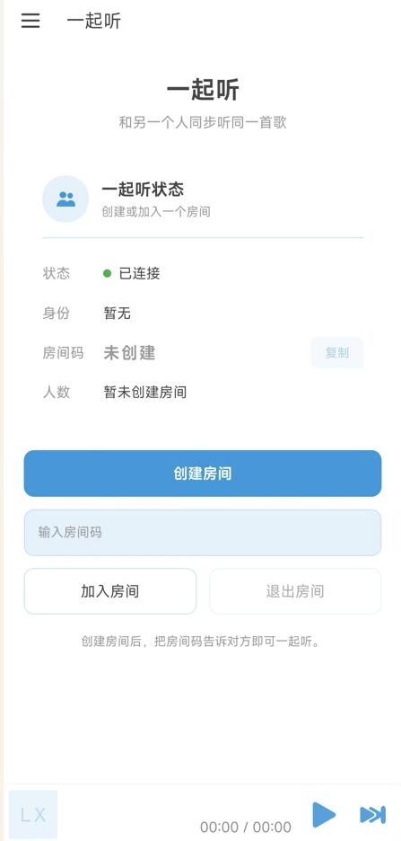

# Cile Music 移动版 · 一起听

<p align="center"></p>

基于 [LX Music 移动版](https://github.com/lyswhut/lx-music-mobile)（v1.8.4）魔改的个人版本，核心改动是加入了**「一起听」功能**：两台设备（手机与手机、手机与电脑）加入同一房间后，房主的播放状态会实时同步到所有听客端。

> 原始项目 By 落雪无痕（LX Music），Cile Music 修改版 By Ci Le。遵循上游开源协议（Apache-2.0）。

## 一起听是什么
零基础小白完全用AI来完成魔改的用来和对象一起听歌嘿嘿

- **房主广播、听客跟随**：房主的切歌、播放、暂停、进度条拖动都会同步给房间内所有人
- **跨端互通**：安卓端 ↔ 安卓端、安卓端 ↔ 桌面端（[桌面版仓库](https://github.com/Tiannn0512/lx-music-desktop-together)）都可以一起听
- **进度对齐**：切歌后听客自动对齐房主当前进度（含加载耗时补偿）；播放中途加入房间也会先同步房主的完整播放状态
- **智能换源兜底**：收到房主播放的歌曲后，若本机无法直接播放，会自动在同源精确重搜、跨源精确匹配之间降级尝试，绝不触发"出错自动跳歌"

## 使用方法

1. 两台设备都打开 Cile Music，进入侧边栏的 **「一起听」** 页面
2. 一端点 **「创建房间」**，得到 6 位房间码
3. 另一端输入房间码点 **「加入房间」**
4. 房主播放歌曲即可，所有人一起听 🎵

## 自建服务器

客户端默认连接官方演示服务器（Render 免费实例，冷启动约 20 秒）。你也可以自己搭：

- 本地运行：`npm install && npm start`（默认端口 3000，支持 `PORT` 环境变量）
- 客户端改服务器地址：[`src/core/together/index.ts`](src/core/together/index.ts) 的 `SERVER_URL` 常量，改成你的 `wss://你的域名` 或 `ws://IP:端口`，重新打包即可

## 开发与打包

```bash
npm install            # 安装依赖
npm run dev            # 开发调试（真机）
npm run pack:android   # 构建 release APK（输出在 android/app/build/outputs/apk/release/）
```

- 当前版本：v2.0.0 (77)
- 需要配置 Android 签名（`android/keystore.properties` + keystore 文件）才能出 release 包，签名文件不入库

## 目录导览（一起听相关）

- `src/core/together/` — 一起听核心逻辑（WebSocket 连接、房间管理、消息协议、同步控制器、远程歌曲解析）
- `src/screens/Home/Views/Together/` — 一起听页面 UI

## 许可

本项目基于 LX Music 移动版修改，遵循 [Apache-2.0](https://github.com/lyswhut/lx-music-mobile/blob/master/LICENSE) 协议开源。
